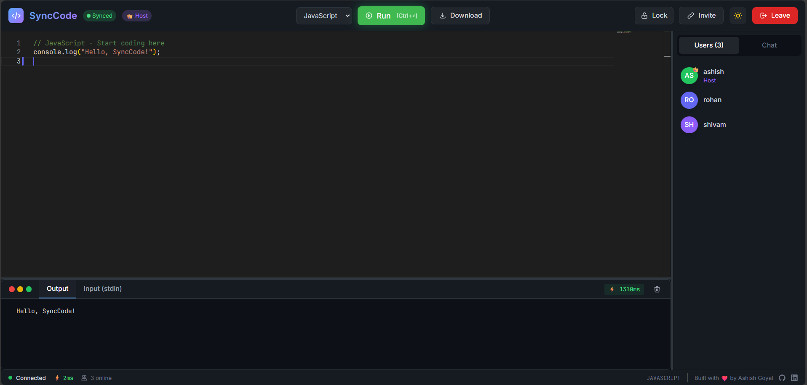
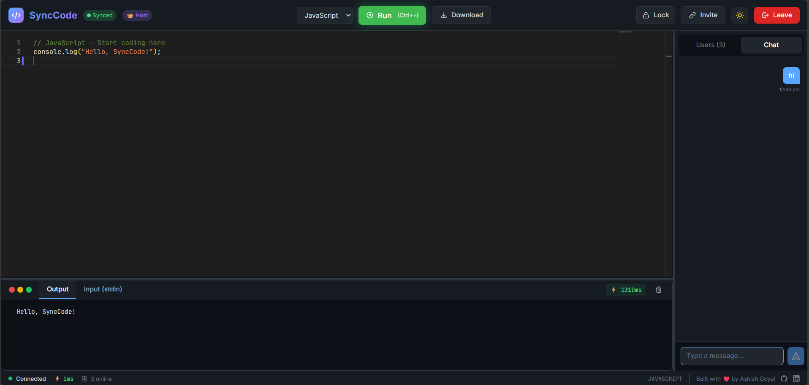
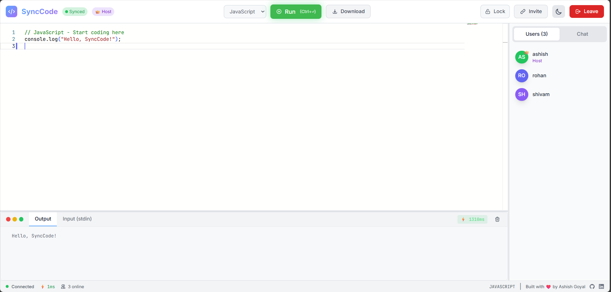
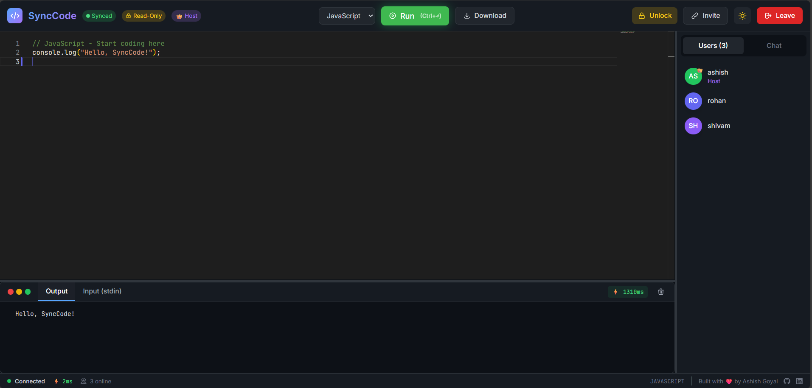

# SyncCode

<div align="center">


A real-time collaborative code editor for **coding interviews**, **pair programming**, and **teaching**. Built with React, Yjs CRDT, and Monaco Editor.

[](https://synccode-five.vercel.app)
[](https://synccode-server-3xzv.onrender.com)

</div>

> ⚠️ **Note:** Server is on Render's free tier. Please allow **50-60 seconds** for initial connection.

> 💡 **Focus:** Single-file collaboration optimized for algorithm problems — not a full IDE.

---

## 📑 Table of Contents

- [Screenshots](#-screenshots)
- [Features](#-features)
- [Tech Stack](#️-tech-stack)
- [Quick Start](#-quick-start)
- [Project Structure](#-project-structure)
- [Architecture](#-architecture)
- [Performance](#-performance)
- [Known Limitations](#️-known-limitations)
- [Roadmap](#️-roadmap)
- [Author](#-author)
- [License](#-license)

---

## 📸 Screenshots

<details>
<summary>Click to expand</summary>

### Home Page


### Multi-User Collaboration


### Room Chat


### Light Mode


### Interview Mode (Room Lock)


</details>

---

## ✨ Features

### 🔄 Real-Time Collaboration (CRDT-Powered)
| Feature | Description |
|---------|-------------|
| **Conflict-Free Sync** | No data loss when multiple users type simultaneously (Yjs CRDT) |
| **Live Code Sync** | See changes instantly as others type |
| **Cursor Presence** | View other users' cursors with name labels |
| **User Avatars** | Colored initials for each participant |

### ⚡ Code Execution
| Feature | Description |
|---------|-------------|
| **Run Code** | Execute code directly via Piston API |
| **8 Languages** | JavaScript, Python, C++, Java, C, TypeScript, Go, Rust |
| **stdin Support** | Input handling for interactive programs |
| **Execution Time** | Shows how long your code took to run |

### 🎯 Interview Mode
| Feature | Description |
|---------|-------------|
| **Host Controls** | First user becomes room host |
| **Read-Only Lock** | Lock room so others can only view |
| **Host Transfer** | Automatic transfer when host leaves |

### 🎨 User Experience
| Feature | Description |
|---------|-------------|
| **Dark/Light Theme** | Toggle with persistence |
| **Download Code** | Export with correct file extension |
| **Keyboard Shortcuts** | `Ctrl+Enter` to run code |
| **Language Templates** | Valid boilerplate when switching languages |
| **Smart Invite Links** | Share URL, auto-fills Room ID |
| **Latency Indicator** | Real-time ping display with color coding |
| **Room Chat** | Built-in messaging with history |

---

## 🛠️ Tech Stack

| Layer | Technology |
|-------|------------|
| **Frontend** | React 18, Vite, Tailwind CSS |
| **Editor** | Monaco Editor (VS Code engine) |
| **Real-Time Sync** | Yjs CRDT + y-monaco binding |
| **Presence & Chat** | Socket.io |
| **Backend** | Node.js, Express, @y/websocket-server |
| **Code Execution** | Piston API (sandboxed) |

> 🔬 **Why Yjs?** Same CRDT technology used by Figma, VS Code Live Share, and CodeSandbox.

---

## 🚀 Quick Start

### Prerequisites
- Node.js 18+
- npm or yarn

### Installation

```bash
# Clone the repository
git clone https://github.com/ashish-goyal-1/synccode.git
cd synccode

# Install server dependencies
cd server && npm install

# Install client dependencies
cd ../client && npm install
```

### Running Locally

```bash
# Terminal 1 - Start server
cd server
npm start
# Runs on http://localhost:5000

# Terminal 2 - Start client
cd client
npm run dev
# Runs on http://localhost:5173
```

### Environment Variables

| Variable | Location | Default | Description |
|----------|----------|---------|-------------|
| `PORT` | server | 5000 | Server port |
| `CLIENT_URL` | server | http://localhost:5173 | CORS origin |
| `VITE_SERVER_URL` | client | http://localhost:5000 | Backend URL |

### Deployment

| Platform | Folder | Key Setting |
|----------|--------|-------------|
| **Render/Railway** | `server/` | Set `CLIENT_URL` |
| **Vercel/Netlify** | `client/` | Set `VITE_SERVER_URL` |

---

## 📁 Project Structure

```
synccode/
├── client/                     # React frontend
│   ├── src/
│   │   ├── components/         # Reusable UI components
│   │   │   ├── Editor.jsx      # Monaco + Yjs binding
│   │   │   ├── Client.jsx      # User avatar
│   │   │   ├── Terminal.jsx    # Code output panel
│   │   │   └── Chat.jsx        # Room messaging
│   │   ├── hooks/
│   │   │   └── useYjs.js       # Yjs CRDT hook
│   │   ├── pages/
│   │   │   ├── Home.jsx        # Room join/create
│   │   │   └── EditorPage.jsx  # Main editor view
│   │   └── socket.js           # Socket.io config
│   └── package.json
│
├── server/                     # Node.js backend
│   ├── index.js                # Express + Socket.io + Yjs
│   └── package.json
│
├── ARCHITECTURE.md             # Detailed technical docs
└── README.md                   # This file
```

---

## 🔌 Architecture

SyncCode uses a **Dual-Channel Architecture** for optimal performance:

```
┌─────────────────────────────────────────────────────────────┐
│                         CLIENT                              │
├─────────────────────────────────────────────────────────────┤
│  ┌─────────────────────┐      ┌─────────────────────────┐   │
│  │   Yjs WebSocket     │      │      Socket.io          │   │
│  │   (Document Sync)   │      │   (Presence & Chat)     │   │
│  └──────────┬──────────┘      └───────────┬─────────────┘   │
└─────────────┼─────────────────────────────┼─────────────────┘
              │                             │
              ▼                             ▼
┌─────────────────────────────────────────────────────────────┐
│                        SERVER                               │
│  ┌─────────────────────┐      ┌─────────────────────────┐   │
│  │  @y/websocket-server│      │     Socket.io Server    │   │
│  │  (CRDT Protocol)    │      │   (Events & Rooms)      │   │
│  └─────────────────────┘      └─────────────────────────┘   │
└─────────────────────────────────────────────────────────────┘
```

| Channel | Purpose | Protocol |
|---------|---------|----------|
| **Yjs WebSocket** | Code synchronization | Binary (efficient) |
| **Socket.io** | Chat, cursors, room state | JSON (flexible) |

> 📖 See [ARCHITECTURE.md](./ARCHITECTURE.md) for detailed documentation.

---

## ⚡ Performance

Load tested using custom Socket.IO stress tool (`load-test.js`):

| Metric | Local (50 users) | Render (20 users) |
|--------|------------------|-------------------|
| **Success Rate** | 100% | 100% |
| **Avg Latency** | 22.46ms | 257.90ms |
| **Min Latency** | 13ms | 217ms |
| **Max Latency** | 65ms | 349ms |
| **Messages Sent** | 91 | 33 |

> **Note on Latency:** The difference between Local (~22ms) and Render (~258ms) is due to **Free Tier infrastructure overhead** (shared CPU/SSL processing) and public internet routing (Client in India ↔ Server in Singapore). Upgrading to a paid instance would significantly reduce this processing overhead.

> 🧪 **Run tests yourself:**
> ```bash
> # Install test dependencies (one-time)
> npm install socket.io-client
> 
> # Run local test (start server first)
> node load-test.js local 50
> 
> # Run production test
> node load-test.js render 20
> ```

---

## ⚠️ Known Limitations

| Limitation | Details |
|------------|---------|
| **y-monaco edge case** | Position translation can occasionally drift at specific character boundaries. This is a [documented y-monaco limitation](https://github.com/yjs/y-monaco/issues), not in SyncCode's implementation. |
| **Render cold start** | Free tier server takes 50-60 seconds to wake after inactivity. |
| **Single file only** | Designed for algorithm problems, not multi-file projects. |

---

## 🗺️ Roadmap

- [ ] Persistent room storage (MongoDB/Redis)
- [ ] User authentication & session history
- [ ] Video/voice chat (WebRTC)
- [ ] Multiple files/tabs support
- [ ] Export to GitHub Gist
- [ ] Synced interview timer

---

## 👤 Author

**Ashish Goyal**

[](https://github.com/ashish-goyal-1)
[](https://www.linkedin.com/in/ashish-goyal-66422b257/)

---

## 📝 License

MIT License - feel free to use for your own projects!

---

## 🙏 Acknowledgments

- [Yjs](https://github.com/yjs/yjs) — CRDT framework
- [Monaco Editor](https://microsoft.github.io/monaco-editor/) — VS Code's editor
- [Piston API](https://github.com/engineer-man/piston) — Code execution
- [Socket.io](https://socket.io/) — Real-time communication
