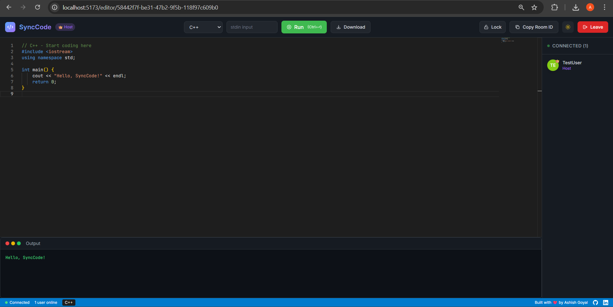
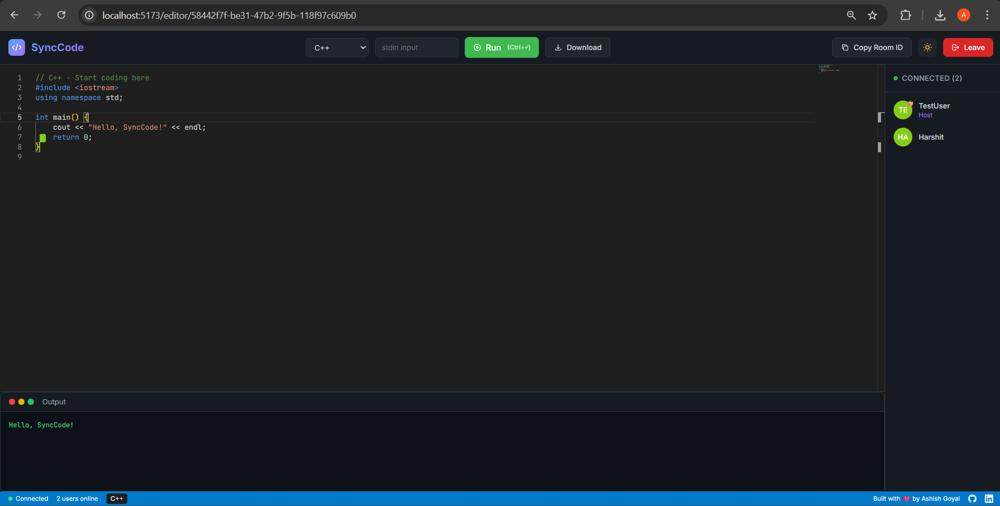

# SyncCode

A real-time collaborative code editor for **coding interviews**, **pair programming**, and **teaching**. Built with React, Yjs CRDT, and Monaco Editor.

🚀 **[Live Demo](https://synccode-five.vercel.app)** | 📦 **[Backend API](https://synccode-server-3xzv.onrender.com)**

> 💡 **Focus:** Single-file collaboration optimized for algorithm problems and code snippets — not a full IDE.


## 📸 Screenshots

### Home Page


### Editor with Code Execution


### Two-User Collaboration


## ✨ Features

### Real-Time Collaboration (CRDT-Powered)
- **Conflict-Free Sync** — No data loss when multiple users type simultaneously (Yjs CRDT)
- **Live Code Sync** — See changes instantly as others type
- **Cursor Presence** — View other users' cursors with name labels
- **User Avatars** — Colored initials for each participant

### Code Execution
- **Run Code** — Execute code directly in the browser via Piston API
- **8 Languages** — JavaScript, Python, C++, Java, C, TypeScript, Go, Rust
- **stdin Support** — Input handling for interactive programs

### Interview Mode
- **Host Controls** — First user becomes room host
- **Read-Only Mode** — Lock room so others can only view
- **Host Transfer** — Automatic transfer when host leaves

### User Experience
- **Dark/Light Theme** — Toggle with persistence
- **Download Code** — Export with correct file extension
- **Keyboard Shortcuts** — `Ctrl+Enter` to run code
- **Language Templates** — Valid boilerplate when switching languages

## 🛠️ Tech Stack

| Layer | Technology |
|-------|------------|
| Frontend | React 18, Vite, Tailwind CSS |
| Editor | Monaco Editor (VS Code engine) |
| Real-Time Sync | **Yjs CRDT** + y-monaco binding |
| Presence & Control | Socket.io |
| Backend | Node.js, Express, y-websocket |
| Execution | Piston API |

> 🔬 **Why Yjs?** Same CRDT technology used by Figma, VS Code Live Share, and CodeSandbox for conflict-free collaboration.

## 🚀 Quick Start

### Prerequisites
- Node.js 18+
- npm or yarn

### Installation

```bash
# Clone the repository
git clone https://github.com/ashish-goyal-1/synccode.git
cd synccode

# Install server dependencies
cd server
npm install

# Install client dependencies
cd ../client
npm install
```

### Running Locally

```bash
# Terminal 1 - Start server
cd server
npm start
# Server runs on http://localhost:5000

# Terminal 2 - Start client
cd client
npm run dev
# Client runs on http://localhost:5173
```

### Environment Variables

Copy `.env.example` to `.env` in both folders:

```bash
# Server
cp server/.env.example server/.env

# Client (optional - uses defaults)
cp client/.env.example client/.env
```

| Variable | Location | Default | Description |
|----------|----------|---------|-------------|
| `PORT` | server | 5000 | Server port |
| `CLIENT_URL` | server | http://localhost:5173 | CORS origin |
| `VITE_SERVER_URL` | client | http://localhost:5000 | Socket server |

### Deployment

**Backend (Render/Railway):**
1. Deploy `server/` folder
2. Set `CLIENT_URL` to your frontend URL

**Frontend (Vercel/Netlify):**
1. Deploy `client/` folder
2. Set `VITE_SERVER_URL` to your backend URL

### Usage

1. Open http://localhost:5173
2. Click **"New"** to generate a room ID
3. Enter your username and click **"Join Room"**
4. Share the Room ID with others to collaborate!

## 📁 Project Structure

```
synccode/
├── client/                 # React frontend
│   ├── src/
│   │   ├── components/     # Reusable components
│   │   │   ├── Editor.jsx      # Monaco + Yjs binding
│   │   │   ├── Client.jsx      # User avatar
│   │   │   ├── Terminal.jsx    # Output panel
│   │   │   └── ThemeToggle.jsx # Dark/light switch
│   │   ├── hooks/
│   │   │   └── useYjs.js       # Yjs CRDT hook
│   │   ├── pages/
│   │   │   ├── Home.jsx        # Join room form
│   │   │   └── EditorPage.jsx  # Main editor view
│   │   └── socket.js       # Socket.io singleton
│   └── package.json
│
└── server/                 # Node.js backend
    ├── index.js            # Socket.io + Yjs WebSocket server
    └── package.json
```

## 🔌 Architecture

| Protocol | Purpose |
|----------|--------|
| **y-websocket** | CRDT code sync (automatic conflict resolution) |
| **Socket.io** | User presence, language change, room lock/unlock |

### Socket.io Events

| Event | Direction | Description |
|-------|-----------|-------------|
| `join` | Client → Server | Join a room |
| `joined` | Server → All | User list update |
| `language_change` | Bidirectional | Language switch |
| `toggle_lock` | Client → Server | Lock/unlock room |
| `lock_changed` | Server → All | Lock state update |

## 🎯 Use Cases

SyncCode is optimized for **single-file collaboration** scenarios:

| Use Case | How It Helps |
|----------|-------------|
| **Coding Interviews** | Host locks room, candidate codes, no data loss if both type |
| **Algorithm Practice** | LeetCode-style problems with a partner |
| **Teaching** | Instructor controls, students observe in real-time |
| **Code Reviews** | Walk through a function together |

> 💡 **Focused on:** Single-file collaboration — perfect for interviews and learning.

## 🗺️ Roadmap

Planned for future versions:

- [ ] Export to GitHub Gist (shareable permanent links)
- [ ] User accounts & session history
- [ ] Interview timer with sync
- [ ] Voice chat integration

## 👤 Author

**Ashish Goyal**

[](https://github.com/ashish-goyal-1)
[](https://www.linkedin.com/in/ashish-goyal-66422b257/)

## 📝 License

MIT License - feel free to use for your own projects!

## 🙏 Acknowledgments

- [Yjs](https://github.com/yjs/yjs) — CRDT framework for conflict-free collaboration
- [Monaco Editor](https://microsoft.github.io/monaco-editor/) — VS Code's editor
- [Piston API](https://github.com/engineer-man/piston) — Code execution engine
- [Socket.io](https://socket.io/) — Real-time communication
